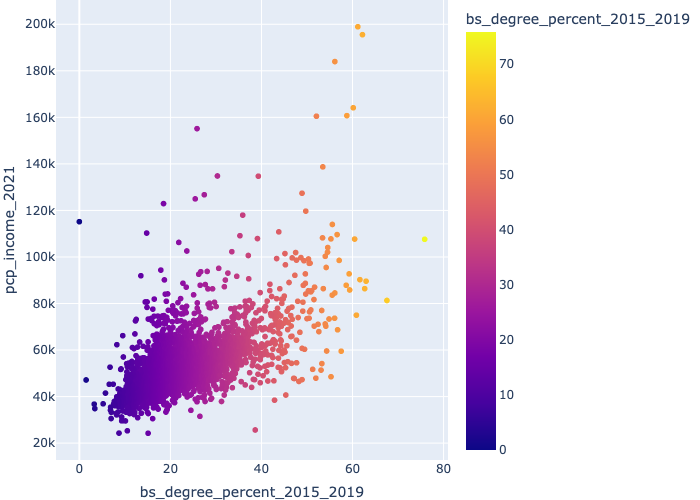
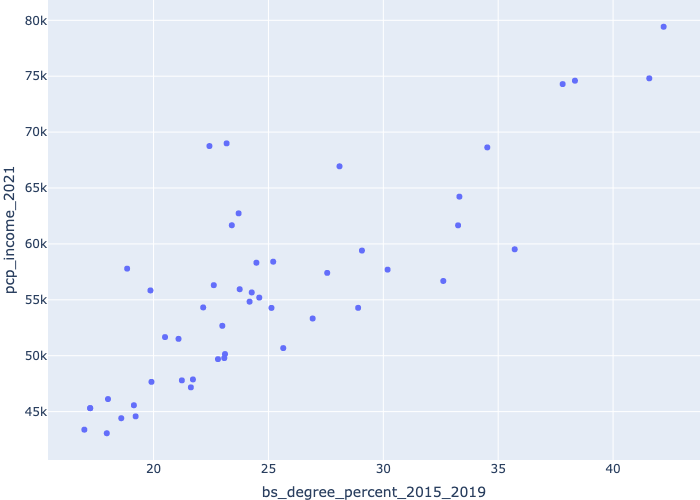

## Income vs education
Link of repo[: ericmamaniramirez13 repo](https://github.com/ericmamaniramirez13/challenge_county_data/blob/main/education_vs_income.py)

United States per capita personal income by county (2021) vs. level of education.
- Source: [kaggle](https://www.kaggle.com/datasets/ruddygunawan/per-capita-income-by-county-2021-vs-education/data?select=US+counties+-+education+vs+per+capita+personal+income+-+results-20221227-213216.csv) 

Columns in our dataframe

county_FIPS: fips code
state: abreaviated state
county: name of the county
per_capita_personal_income_2019: income per capita 2019
per_capita_personal_income_2020:income per capita 2020
per_capita_personal_income_2021:income per capita 2021
associate_degree_numbers_2016_2020: number of AS degrees from 2016 to 2020
bachelor_degree_numbers_2016_2020: number of BS degrees from 2016 to 2020
associate_degree_percentage_2016_2020: percentage of people with AS degree
bachelor_degree_percentage_2015_2019: percentage of people with a BS degree

## Missingness

There're no missing values in our dataframe
#### Image 1
Map of the US showing education by county

#### Image 2
Counties with higher percentage of education (BS) have better income overalll

#### Image 3
Agreagated data by state and showing states with higher level of education have a better income per capita

## Data Snippet

|    |   county_FIPS | state   | county         |   per_capita_personal_income_2019 |   per_capita_personal_income_2020 |   per_capita_personal_income_2021 |   associate_degree_numbers_2016_2020 |   bachelor_degree_numbers_2016_2020 |   associate_degree_percentage_2016_2020 |   bachelor_degree_percentage_2015_2019 |
|---:|--------------:|:--------|:---------------|----------------------------------:|----------------------------------:|----------------------------------:|-------------------------------------:|------------------------------------:|----------------------------------------:|---------------------------------------:|
|  0 |         51013 | VA      | Arlington, VA  |                             97629 |                            100687 |                            107603 |                                19573 |                              132394 |                                   11.21 |                                  75.84 |
|  1 |         35028 | NM      | Los Alamos, NM |                             72366 |                             75949 |                             81306 |                                 2766 |                                9098 |                                   20.54 |                                  67.56 |
|  2 |          8013 | CO      | Boulder, CO    |                             79698 |                             83173 |                             89593 |                                45834 |                              135876 |                                   21.24 |                                  62.97 |