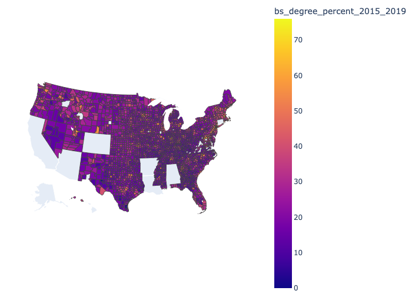

## Income vs education
Link of repo[: ericmamaniramirez13 repo](https://github.com/ericmamaniramirez13/challenge_county_data/blob/main/education_vs_income.py)

United States per capita personal income by county (2021) vs. level of education.
- Source: [kaggle](https://www.kaggle.com/datasets/ruddygunawan/per-capita-income-by-county-2021-vs-education/data?select=US+counties+-+education+vs+per+capita+personal+income+-+results-20221227-213216.csv) 

Columns in our dataframe

county_FIPS: fips code
state: abreaviated state
county: name of the county
per_capita_personal_income_2019: income per capita 2019
per_capita_personal_income_2020:income per capita 2020
per_capita_personal_income_2021:income per capita 2021
associate_degree_numbers_2016_2020: number of AS degrees from 2016 to 2020
bachelor_degree_numbers_2016_2020: number of BS degrees from 2016 to 2020
associate_degree_percentage_2016_2020: percentage of people with AS degree
bachelor_degree_percentage_2015_2019: percentage of people with a BS degree

## Missingness

There're no missing values in our dataframe
#### Image 1
Map of the US showing education by county

#### Image 2
Counties with higher percentage of education (BS) have better income overalll

#### Image 3
Agreagated data by state and showing states with higher level of education have a better income per capita

## Data Snippet

| county_FIP | state | county     | per_capita | … | associate | bachelor_ | associate | bachelor_ |
| S          |       |            | _personal_ |   | _degree_n | degree_nu | _degree_p | degree_pe |
|            |       |            | income_201 |   | umbers_20 | mbers_201 | ercentage | rcentage_ |
|            |       |            | 9          |   | 16_20…    | 6_202…    | _2016…    | 2015_…    |
|------------|-------|------------|------------|---|-----------|-----------|-----------|-----------|
| 51013      | VA    | Arlington, | 97629      | … | 19573     | 132394    | 11.21     | 75.84     |
|            |       | VA         |            |   |           |           |           |           |
| 35028      | NM    | Los        | 72366      | … | 2766      | 9098      | 20.54     | 67.56     |
|            |       | Alamos, NM |            |   |           |           |           |           |
| 8013       | CO    | Boulder,   | 79698      | … | 45834     | 135876    | 21.24     | 62.97     |
|            |       | CO         |            |   |           |           |           |           |
| 24027      | MD    | Howard, MD | 78013      | … | 42538     | 136792    | 19.49     | 62.67     |
| …          | …     | …          | …          | … | …         | …         | …         | …         |
| 28055      | MS    | Issaquena, | 24805      | … | 271       | 34        | 27.07     | 3.4       |
|            |       | MS         |            |   |           |           |           |           |
| 2158       | AK    | Kusilvak   | 31050      | … | 854       | 132       | 21.11     | 3.26      |
|            |       | Census     |            |   |           |           |           |           |
|            |       | Area, AK   |            |   |           |           |           |           |
| 48261      | TX    | Kenedy, TX | 43786      | … | 16        | 4         | 5.93      | 1.48      |
| 48301      | TX    | Loving, TX | 108522     | … | 72        | 0         | 81.82     | 0.0       |