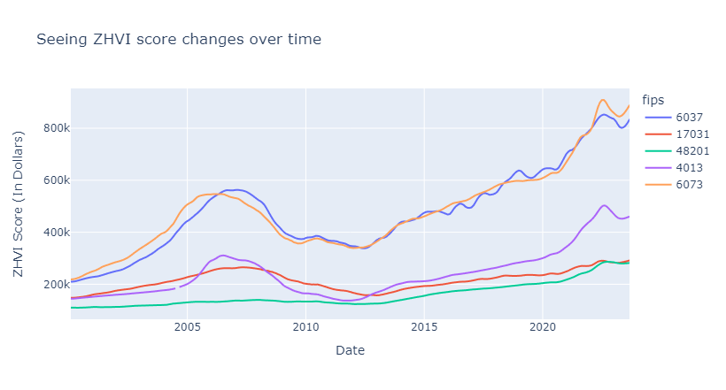
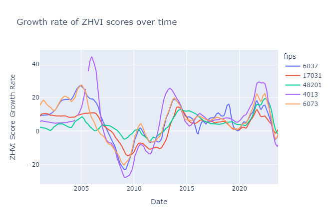

# zhvi (Zillow Zestimates data)

## Objective

To identify, extract, and convert United States data at the county level to `.parquet` that supports our temple estimation project.

## Data Background

From the [Zillow Website](https://www.zillow.com/research/methodology-neural-zhvi-32128/)

"The Zillow Home Value Index (ZHVI) is designed to capture the value of a typical property across the nation or the neighborhood, not just the homes that sold, and we do so by drawing information from the full distribution of homes in a given region. 

ZHVI measures monthly changes in property-level Zestimates, capturing both the level and appreciation of home values across a wide variety of geographies and housing types (e.g., all single-family homes in ZIP code 98101). This is how we focus on actual market price changes, and not changes in the kinds of markets or property types that sell from month to month."

This data can be used to see trends over time of general house prices per county.

## Missing Values

There are several months, especially in less populated counties, where a ZHVI score was not recorded. The closer you move towrds the present the more fields there are that have a ZHVI score. We have assigned these missing values as `nan`. There are a few counties that have no data, but are still represented in the data.

## Data Dictionary

* fips - i64 - fips code for the county

* SizeRank - i64 - size ranking to other counties by population (0 is the most populated county)

* Metro - str - Metro area (Major City) that this county is associated with

* *dates* - f64 - the ZHVI score for the county for this month in dollars (recorded at the end of the month so 2000-01-31 is for January, 2000)

* Growth_*dates* - This is going to be the yearly growth rates in the form from same month to same month

## Data Table Snippet
|    |   fips |   SizeRank | Metro                     |   2000-01-31 |   2000-02-29 |   2000-03-31 |   2000-04-30 |
|---:|-------:|-----------:|:--------------------------|-------------:|-------------:|-------------:|-------------:|
|  0 |   1001 |        904 | Montgomery, AL            |       119113 |       119142 |       118947 |       118873 |
|  1 |   1003 |        302 | Daphne-Fairhope-Foley, AL |       133903 |       134113 |       134348 |       134816 |
|  2 |   1005 |       1635 | Eufaula, AL-GA            |          nan |          nan |          nan |          nan |
|  3 |   1007 |       1751 | Birmingham-Hoover, AL     |          nan |          nan |          nan |          nan |
|  4 |   1009 |        894 | Birmingham-Hoover, AL     |          nan |          nan |          nan |          nan |

Last 5 columns:

|    |   Growth_2023-01-31 |   Growth_2023-03-31 |   Growth_2023-05-31 |   Growth_2023-07-31 |   Growth_2023-08-31 |
|---:|--------------------:|--------------------:|--------------------:|--------------------:|--------------------:|
|  0 |             7.1913  |             4.82099 |            3.55117  |             2.89773 |             2.71866 |
|  1 |             8.08966 |             5.60528 |            4.06526  |             3.39797 |             3.19732 |
|  2 |             1.21863 |             2.24482 |            3.66391  |             1.83544 |             0.14776 |
|  3 |             5.11268 |             3.44227 |            3.65038  |             1.15784 |            -0.14049 |
|  4 |             6.06723 |             2.19812 |           -0.142145 |            -1.05954 |            -1.41448 |

## Images to show data use case

#### fips codes for reference

* 6037 - Los Angeles County, CA
* 17031 -  Cook County, IL
* 48201 - Harris County, TX
* 4013 - Maricopa County, AZ
* 6073 - San Diego County, CA